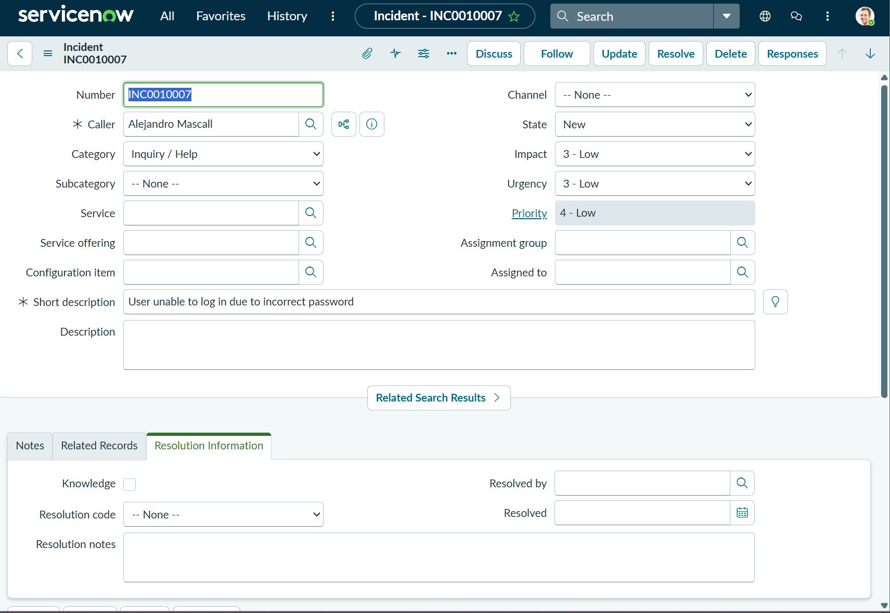

# ServiceNow Incident Lifecycle Practice (Home Lab)

## Objective
Practice the full incident lifecycle in ServiceNow by creating, managing, and resolving simulated IT support tickets.

---

## Environment
- Platform: ServiceNow Personal Developer Instance
- Access Level: Admin (Platform View)

---

## Overview
In this lab, I simulated real-world IT support scenarios by creating multiple incidents and managing them through the full lifecycle from creation to closure.

---

## Incident Lifecycle Process

### Stages Practiced
- New
- In Progress
- Resolved
- Closed

---

## Resolution Code Usage

- Solution Provided → Used when issue was fixed
- User Error → Used when issue was caused by incorrect user action
- Workaround Provided → Used for temporary fixes

---

## Tickets Created

### Ticket 1 — Account Lockout
- Resolution Code: Solution Provided

### Ticket 2 — Password Reset
- Resolution Code: Solution Provided

### Ticket 3 — Outlook Issue
- Resolution Code: Solution Provided

### Ticket 4 — VPN Access Issue
- Resolution Code: Solution Provided

### Ticket 5 — Software Installation
- Resolution Code: Solution Provided

---

## Screenshots

---

## What I Learned
- How IT support teams manage incidents using ticketing systems
- How to properly document work notes and resolutions
- How to apply appropriate resolution codes
- How to simulate real-world troubleshooting workflows

---

## Summary
Practiced complete incident lifecycle management in ServiceNow, including ticket creation, investigation, resolution, and closure, using proper help desk documentation standards.
